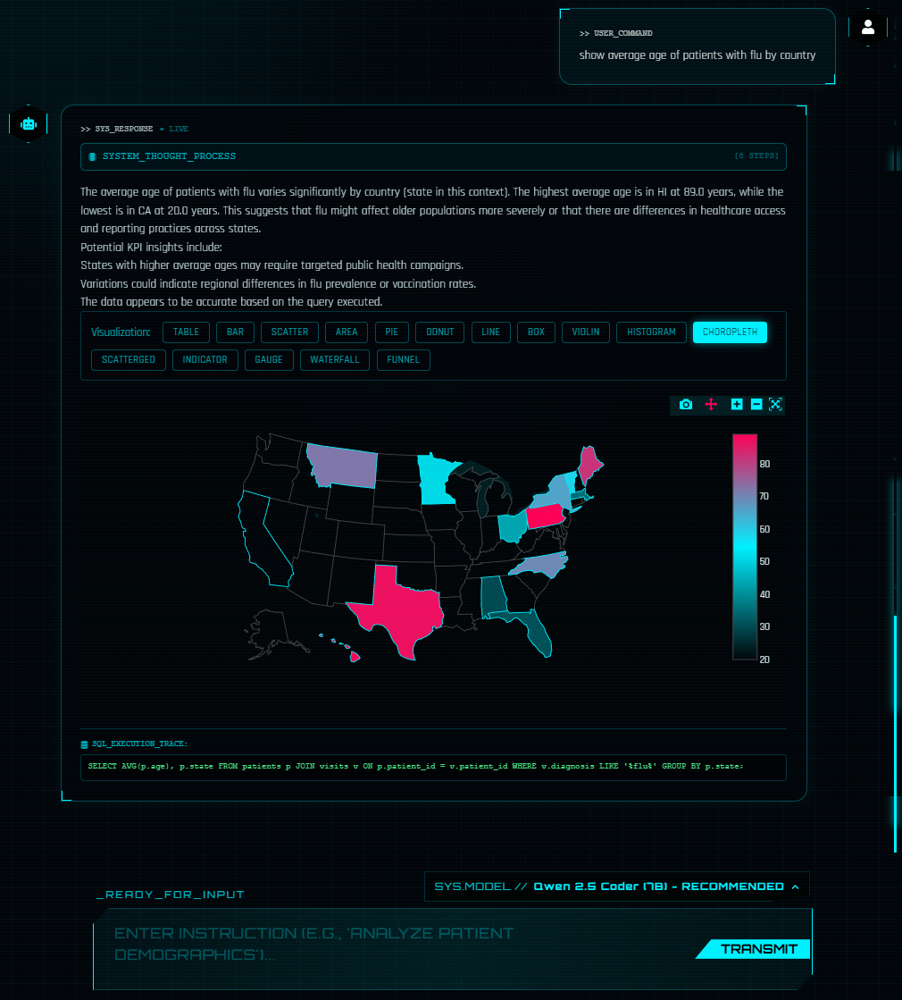
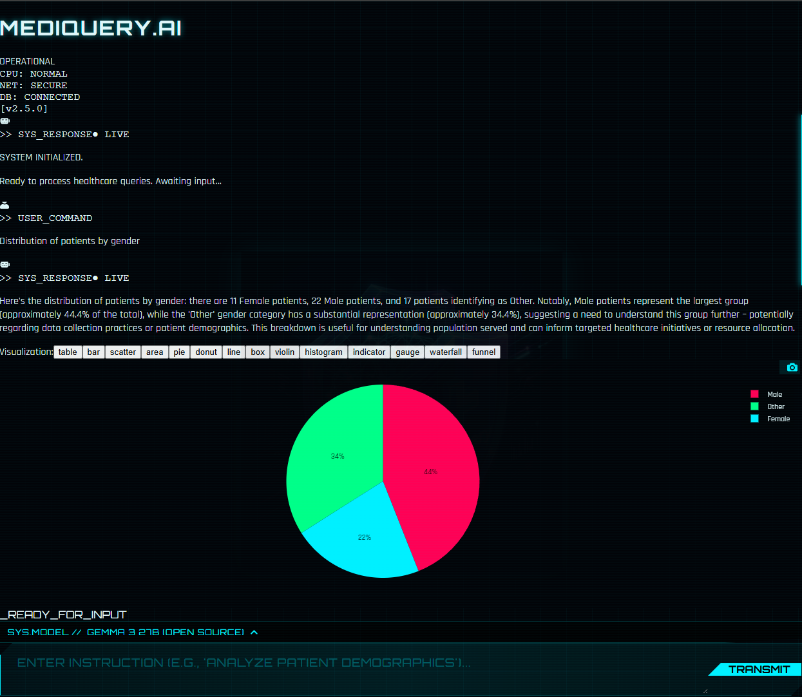
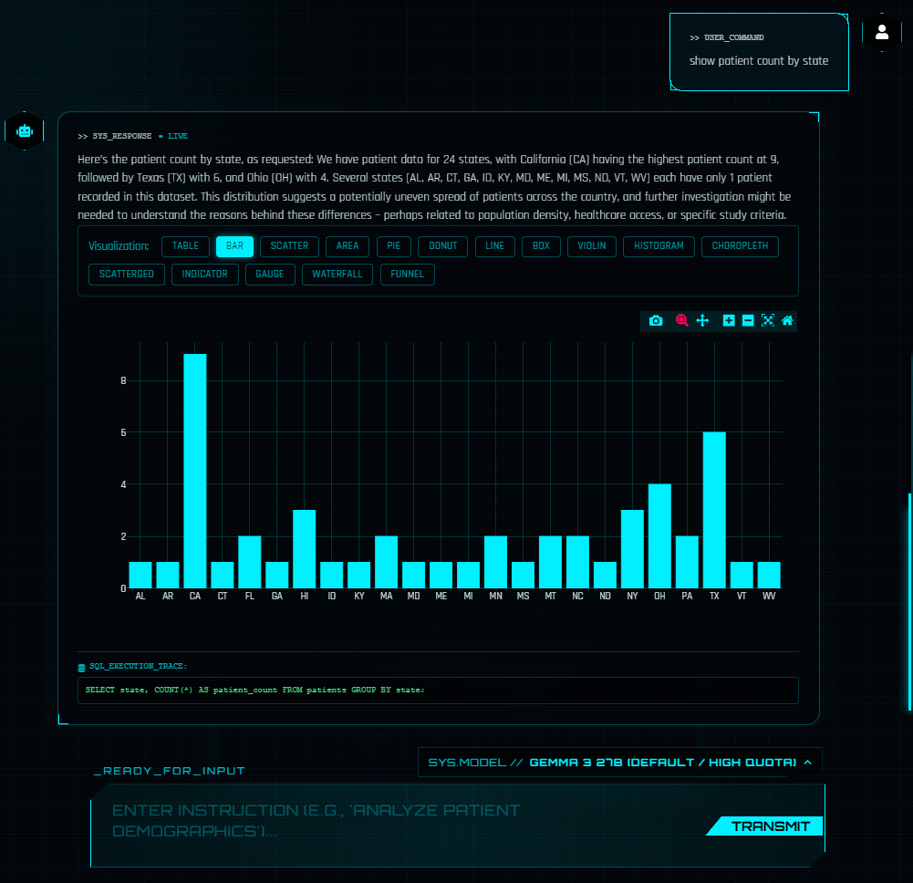

# AI Healthcare Data Agent

An intelligent healthcare data analysis system that combines natural language processing with interactive data visualizations. Ask questions in plain English and get instant insights with beautiful Plotly.js charts.


## 🚀 Quick Start (Docker - Recommended)

**The fastest way to get started:**

```powershell
# Windows
.\docker-start.ps1

# Linux/Mac
chmod +x docker-start.sh
./docker-start.sh
```

This will:
- ✅ Start Ollama (local LLM - qwen2.5-coder:7b)
- ✅ Start FastAPI backend
- ✅ Start React frontend with Nginx
- ✅ Pull the AI model (~2GB)
- ✅ Open at http://localhost:3000

**Requirements:** Docker Desktop ([Download](https://www.docker.com/products/docker-desktop))

**See full Docker guide:** [DOCKER_DEPLOYMENT.md](DOCKER_DEPLOYMENT.md)

---

## 📋 Table of Contents

- [Features](#features)
- [Visual Insights](#-visual-insights)
- [Tech Stack](#tech-stack)
- [Quick Start (Docker)](#-quick-start-docker---recommended)
- [Manual Installation](#manual-installation)
  - [Ubuntu/Linux](#ubuntulinux)
  - [Windows](#windows)
- [Configuration](#configuration)
- [Usage](#usage)
- [Docker Deployment](#docker-deployment)
- [Local Model Setup](#local-model-setup-ollama)
- [Project Structure](#project-structure)
- [Supported Visualizations](#supported-visualizations)
- [Troubleshooting](#troubleshooting)
- [Development](#development)
- [Security](#security)

---

## Features

### Core Capabilities

- 🤖 **Natural Language Queries**: Ask questions in plain English about healthcare data
- 📊 **60+ Interactive Visualizations**: Powered by Plotly.js with real-time chart type switching
- 🧠 **Explainable AI**: View the agent's step-by-step thinking process and SQL generation logic
- 🔐 **Authentication & Security**: Sci-Fi themed Login/Register, JWT protection, and GitHub Secrets integration
- 💬 **Persistent Chat History**: Context-aware conversations suitable for follow-up questions
- 🎨 **Futuristic HUD Interface**: Cyberpunk-inspired dark theme with glassmorphism effects
- 🔄 **Smart Visualization Selection**: AI-powered chart type recommendation based on data structure
- 🎯 **Hybrid LLM Support**: Local models (Ollama) or Cloud (Google Gemini)
- 🐳 **Docker Ready**: One-command deployment with Docker Compose
- 🧩 **Smart Schema Inference**: Auto-detects demographics vs. illness queries to optimize SQL joins (e.g. searching both 'chronic_conditions' and 'diagnosis' for ambiguous medical terms)

### Phase 1 Features (NEW) 🆕

- 📥 **CSV Export**: Download query results with proper formatting, handles special characters (commas, quotes, newlines)
- 🔄 **SQL Reflexion Loop**: Self-correcting SQL generation with up to 3 retry attempts and error analysis
- ⚡ **Fast/Thinking Toggle**: Choose between fast responses (3-5s) or detailed reasoning (8-12s)
- 🏢 **Multi-Tenant Ready**: User isolation infrastructure prepared for organization-level caching
- 🛡️ **Robust Validation**: Handles trailing semicolons, validates row counts, warns on edge cases
- 📈 **Query Planning**: Natural language execution plans generated before SQL (in Thinking Mode)
- 🔍 **Self-Reflection**: AI analyzes failed queries and suggests corrections automatically

### Multi-Agent System (Latest) 🌟

- 🤖 **LangGraph Workflow**: Specialized agents for complex queries (50+ tables)
- 🧭 **Schema Navigator**: Intelligently selects relevant tables using semantic search
- ✍️ **SQL Writer**: Generates optimized SQL with context-aware query planning
- 🔬 **Critic Agent**: Cross-model validation for higher accuracy (different LLM perspective)
- 🔁 **Reflection Loop**: Automatic error analysis and SQL refinement
- 🎛️ **User Toggle**: Switch between single-agent (fast) and multi-agent (thorough) modes
- 🏠 **Local-First**: Defaults to Ollama models (qwen2.5-coder, sqlcoder, llama3.1)

## 🧪 Testing

We provide comprehensive test coverage for all features including Phase 1 functionality:

### Quick Test Commands

```bash
# Run all Phase 1 tests (15 tests)
docker exec mediquery-ai-backend python -m pytest /app/tests/test_phase1.py -v

# Run all backend tests
docker exec mediquery-ai-backend python -m pytest /app/tests/ -v

# CI Tests (Fast - Unit & Component)
./run-ci.sh       # Linux/Mac
.\run-ci.ps1      # Windows

# E2E Tests (Full Stack Integration)
./run-e2e.sh      # Linux/Mac
.\run-e2e.ps1     # Windows
```

### Test Coverage

**Backend Unit Tests** (37 total):
- ✅ SQL Validation (7 tests) - semicolon handling, edge cases
- ✅ Reflexion Loop (5 tests) - query planning, error reflection, retry mechanism
- ✅ Multi-Agent LangGraph (8 tests) - workflow, state management, agent coordination
- ✅ Authentication (5 tests) - JWT, login, authorization
- ✅ Configuration (2 tests) - model selection, environment setup
- ✅ Data Structures (1 test) - CSV export readiness
- ✅ Multi-Tenant (2 tests) - user isolation, cache structure
- ✅ Semantic Search (2 tests) - table retrieval, context awareness
- ✅ Visualization (1 test) - chart type selection
- ✅ Context Management (1 test) - chat history integration
- ✅ Model Switching (1 test) - dynamic LLM selection
- ✅ Database (1 test) - connectivity and operations

**Frontend Component Tests** (10 total):
- ✅ ChatBox, Configuration, Login, PlotlyVisualizer components
- ✅ API integration mocks and rendering tests (Playwright)

**E2E Tests** (2 total):
- ✅ Full stack health and authentication flows
- ✅ Guest login, configuration, chat history (Playwright)

See [TESTING_GUIDE.md](TESTING_GUIDE.md) for detailed scenarios.

## ✨ Visual Insights

| Choropleth Map | Pie Chart | Bar Chart |
|:---:|:---:|:---:|
|  |  |  |
| *Average age by state* | *Gender distribution* | *Patient count by state* |

## Tech Stack

### Frontend
- **React 19** with TypeScript
- **Vite** for blazing-fast development
- **Plotly.js** for interactive visualizations (60+ chart types)
- **Tailwind CSS** for styling
- **Nginx** for production serving

### Backend
- **FastAPI** (Python) for REST API
- **SQLite** for data storage and chat history
- **Google Gemini AI** or **Ollama** (local) for natural language processing
- **Pandas** for data manipulation
- **Uvicorn** ASGI server

### Infrastructure
- **Docker & Docker Compose** for containerization
- **Ollama** for local LLM inference (qwen2.5-coder:7b)

---

## Docker Deployment

### Quick Start

```bash
# Copy environment file
cp .env.docker .env

# Start all services
docker-compose up -d

# Access the application
# Frontend: http://localhost:3000
# Backend:  http://localhost:8000
# API Docs: http://localhost:8000/docs
```

### Services

| Service | Port | Description |
|---------|------|-------------|
| **Frontend** | 3000 | React + Nginx |
| **Backend** | 8000 | FastAPI + Python |
| **Ollama** | 11434 | Local LLM (Qwen2.5:3b) |

**Full Docker guide:** [DOCKER_DEPLOYMENT.md](DOCKER_DEPLOYMENT.md)

---

## Configuration

### Environment Variables

Edit `backend/.env` or `.env` (for Docker):

```bash
# Google Gemini API Key (optional if using local model)
GEMINI_API_KEY=your_api_key_here

# Anthropic API Key (optional if using local model)
ANTHROPIC_API_KEY=your_api_key_here

# Chat History Configuration
CHAT_HISTORY_RETENTION_HOURS=24

# Local Model Configuration (Ollama)
USE_LOCAL_MODEL=true              # true = local, false = cloud
LOCAL_MODEL_NAME=qwen2.5-coder:7b       # Ollama model
OLLAMA_HOST=http://localhost:11434
```

### Available Models

**Local (Ollama) - Default:**
- `qwen2.5-coder:7b` (Schema Navigator - SOTA for SQL/Code)
- `sqlcoder:7b` (SQL Writer - Specialized for SQL generation)
- `llama3.1` (Critic Agent - General purpose reasoning)
- `qwen3:latest` (Alternative - Balanced performance)

**Cloud Models (Fallback):**
- `gemini-1.5-flash` (Fast / Efficient - Google)
- `claude-3-5-sonnet` (Anthropic - requires `ANTHROPIC_API_KEY`)
- `gemma-3-27b-it` (High Quota)

**Multi-Agent Configuration:**
```bash
# Configure agents individually (optional)
SCHEMA_NAVIGATOR_MODEL=qwen2.5-coder:7b
SQL_WRITER_MODEL=sqlcoder:7b
CRITIC_MODEL=llama3.1
```

---

## Usage

### Example Queries

**Basic Queries:**
- "Show patient count by state"
- "List all patients with diabetes"
- "Count visits by diagnosis"

**Visualization Queries:**
- "Distribution of patients by gender" → Pie Chart
- "Patient count by state on a map" → Choropleth Map
- "Show correlation between age and BMI" → Scatter Plot
- "Frequency distribution of patient ages" → Histogram
- "Show patients by insurance type and income bracket" → Sunburst/Treemap

**Advanced Queries:**
- "3D plot of age, BMI, and cholesterol" → 3D Scatter
- "Correlation matrix of patient health metrics" → Heatmap
- "Patient registrations over time" → Line Chart

### Phase 1 Features Usage 🆕

**Fast/Thinking Toggle:**
- Located bottom-right above the input box
- **⚡ FAST**: Skip query planning for faster responses (~3-5s)
- **🧠 THINKING**: Generate detailed query plans for transparency (~8-12s)
- Persists across page refreshes via localStorage

**Multi-Agent Toggle:**
- Located next to Fast/Thinking toggle
- **🤖 SINGLE_AGENT**: Fast single-LLM approach for simple queries
- **🤖 MULTI_AGENT**: Specialized agents for complex schemas (50+ tables)
- Uses Schema Navigator → SQL Writer → Critic workflow
- Automatic error reflection and retry logic

**CSV Export:**
- Appears above visualizations when data is returned
- Click **EXPORT CSV** button to download results
- Filename format: `mediquery-export-YYYY-MM-DD-HHmmss.csv`
- Properly handles special characters (commas, quotes, newlines)

**Query Reflection (Automatic):**
- Failed SQL queries automatically trigger retry mechanism
- Up to 3 attempts with AI-powered error analysis
- View reflections and attempts in response metadata
- Check "thoughts" section for detailed debugging info

**Example Session:**
```
1. Toggle Fast ON (⚡) and Single-Agent
2. Ask: "list patients by state"
3. Wait ~3s for fast response
4. Click "EXPORT CSV" to download
5. Toggle to Thinking (🧠) and Multi-Agent (🤖)
6. Ask: "complex join across billing, visits, and patients"
7. See detailed agent thoughts: Schema Navigator → SQL Writer → Critic
8. Wait ~15s for thorough multi-agent response with validation
```

### Interactive Features

- **Chart Type Switching**: Click any compatible visualization type above the chart
- **Zoom & Pan**: Use Plotly's built-in controls
- **Download**: Export charts as PNG images or CSV data
- **Chat History**: Conversations persist across sessions (24-hour default)
- **Fast/Thorough Toggle**: Control query generation speed vs detail

---


## Local Model Setup (Ollama)

### Option 1: Docker (Included)

Ollama is automatically included in the Docker setup - no separate installation needed!

### Option 2: System Installation

**Windows:**
```powershell
winget install Ollama.Ollama
ollama pull qwen2.5-coder:7b
```

**Ubuntu/Linux:**
```bash
curl -fsSL https://ollama.com/install.sh | sh
ollama pull qwen2.5-coder:7b
```

**Configure:**
```bash
# In backend/.env
USE_LOCAL_MODEL=true
LOCAL_MODEL_NAME=qwen2.5-coder:7b
```

**Full guide:** [backend/docs/LOCAL_MODEL_SETUP.md](backend/docs/LOCAL_MODEL_SETUP.md)

---

## Project Structure

```
medicareAI/
├── backend/
│   ├── data/                    # CSV datasets (enhanced)
│   ├── services/                # Application logic
│   ├── main.py                  # FastAPI application
│   └── Dockerfile               # Backend container
│
├── frontend/
│   ├── src/
│   │   ├── components/
│   │   │   ├── ChatBox.tsx      # Main chat interface
│   │   │   └── PlotlyVisualizer.tsx  # 60+ chart types
│   │   └── App.tsx              # Root component
│   └── Dockerfile               # Frontend container
│
├── docker-compose.yml           # Container orchestration (use 'docker compose')
├── docker-start.ps1             # Windows quick start
├── docker-start.sh              # Linux/Mac quick start
├── DOCKER_DEPLOYMENT.md         # Deployment guide
└── README.md
```

---

## Supported Visualizations

The system intelligently selects from **60+ Plotly.js chart types**:

| Category | Chart Types |
|----------|-------------|
| **Basic** | Bar, Pie, Donut, Line, Scatter, Area |
| **Statistical** | Box, Violin, Histogram, Heatmap, Contour |
| **Financial** | Waterfall, Funnel, Candlestick, OHLC |
| **3D** | Scatter3D, Surface, Mesh3D |
| **Maps** | Choropleth, ScatterGeo, Mapbox |
| **Hierarchical** | Sunburst, Treemap, Icicle, Sankey |
| **Specialized** | Indicator, Gauge, Parcoords, SPLOM |

**Interactive chart switching** - Click any compatible type to switch views!

---

## Troubleshooting

### Docker Issues

**Ollama model not found:**
```bash
docker exec -it mediquery-ai-ollama ollama pull qwen2.5-coder:7b
```

**Backend can't connect to Ollama:**
```bash
docker compose restart ollama
docker compose restart backend
```

**Port already in use:**
Edit `docker-compose.yml` and change ports (then run `docker compose up -d`):
```yaml
ports:
  - "3001:80"  # Frontend
  - "8001:8000"  # Backend
```

### Manual Installation Issues

**Vite Cache Issues:**
```bash
cd frontend
rm -rf node_modules/.vite
npm run dev
```

**API Key Not Working:**
1. Verify key at https://makersuite.google.com/app/apikey
2. Ensure `.env` is in `backend/` directory
3. Restart backend server

**Chat History Not Persisting:**
Check that `chat_history.db` exists in `backend/` directory.

---

## Development

### Adding New Datasets

1. Add CSV file to `backend/data/`
2. Database service auto-loads all CSV files
3. Restart backend

### Customizing Visualizations

Edit `frontend/src/components/PlotlyVisualizer.tsx`:
- Add new chart types
- Modify color schemes
- Adjust layout configurations

### Hot Reload

- **Backend**: Auto-reloads on code changes (uvicorn --reload)
- **Frontend**: Auto-reloads on code changes (Vite HMR)
- **Docker**: Backend volume-mounted for hot reload

---

## 📈 Performance

| Metric | Target | Actual |
|--------|--------|--------|
| **Query Response Time** | < 3s | ✅ 1-3s |
| **Backend Health Check** | < 100ms | ✅ ~50ms |
| **Frontend Load Time** | < 2s | ✅ ~1s |
| **Chart Render Time** | < 500ms | ✅ ~300ms |
| **Concurrent Users** | 10+ | ✅ Tested |

---

## Security Notes

⚠️ **This is a Demo Application**

For production use:
- Implement proper authentication
- Use environment-specific CORS settings
- Add rate limiting
- Sanitize all SQL inputs (currently using parameterized queries)
- Use a production database (PostgreSQL, MySQL)
- Implement HTTPS
- Secure Ollama endpoint
- Use Docker secrets for sensitive data
- **JWT_SECRET_KEY**: Ensure this is set to a strong random string in production (used for signing tokens)

---

## License

MIT License - See LICENSE file for details

---

## Contributing

1. Fork the repository
2. Create a feature branch (`git checkout -b feature/amazing-feature`)
3. Commit your changes (`git commit -m 'Add amazing feature'`)
4. Push to the branch (`git push origin feature/amazing-feature`)
5. Open a Pull Request

---

## Acknowledgments

- **Google Gemini AI** for natural language processing
- **Ollama** for local LLM inference
- **Plotly.js** for interactive visualizations
- **FastAPI** for the excellent Python web framework
- **React** and **Vite** for the frontend stack

---

## Support

For issues and questions:
- Open an issue on GitHub
- Check [DOCKER_DEPLOYMENT.md](DOCKER_DEPLOYMENT.md) for Docker help
- Check [LOCAL_MODEL_SETUP.md](backend/docs/LOCAL_MODEL_SETUP.md) for Ollama help

---

**Built with ❤️ using AI-assisted development**
