# 📚 Quick Reference: Documentation Structure

**For Humans & AI Agents**

## 🎯 Start Here

**Single Entry Point**: [`docs/INDEX.md`](INDEX.md)  
Read this first to understand current work and context.

---

## 📁 Directory Layout

```
docs/
├── INDEX.md                    # 👈 START HERE
├── plans/
│   ├── active/                 # 🔥 Current work (agents prioritize this)
│   ├── implemented/            # ✅ Completed 
│   └── backlog/                # 💤 Future ideas
├── reports/
│   ├── current/                # 📊 Ongoing work
│   └── archive/{year}/         # 🗄️ Historical reference
└── guides/                     # 📖 Always relevant
```

---

## 🤖 Agent Workflow

### When Implementing a Feature

```mermaid
graph LR
    A[Read docs/INDEX.md] --> B[Open plan from active/]
    B --> C[Check frontmatter for related_files]
    C --> D[Implement task]
    D --> E[✅ Check off in plan frontmatter]
    E --> F[Update INDEX.md progress]
    F --> G[Commit with plan updates]
```



### After Each Task Completion

**MUST UPDATE** (in order):
1. Plan file (`docs/plans/active/*.md`) frontmatter
2. `docs/INDEX.md` progress column
3. `docs/plans/active/README.md` status

### When Plan is 100% Complete

```bash
# 1. Move plan
mv docs/plans/active/plan.md docs/plans/implemented/

# 2. Update plan frontmatter
status: implemented
date_completed: 2026-01-22

# 3. Update INDEX.md
# Move from "Active Plans" to "Recently Completed"

# 4. Archive related report
mv docs/reports/current/report.md docs/reports/archive/2026/
```

---

## 📋 Plan Frontmatter Template

```yaml
---
status: active | implemented | backlog
priority: high | medium | low
date_created: YYYY-MM-DD
date_updated: YYYY-MM-DD
date_completed: YYYY-MM-DD  # only for implemented
related_files:
  - backend/path/to/file.py
  - frontend/path/to/component.tsx
depends_on:
  - docs/plans/active/other-plan.md
blocks: []
assignee: null
completion:  # only for active plans
  - [x] Step 1 - Description ✅
  - [ ] Step 2 - Description
  - [ ] Step 3 - Description
---
```

---

## 🔍 Quick Checks

**Find active work**:
```bash
ls docs/plans/active/*.md
```

**See what's completed**:
```bash
ls docs/plans/implemented/*.md
```

**Find future ideas**:
```bash
ls docs/plans/backlog/*.md
```

**Check progress of active plan**:
```bash
grep -A 5 "completion:" docs/plans/active/*.md
```

---

## 💡 Tips

- **For Agents**: Only read `active/` unless explicitly asked about backlog/history
- **For Humans**: Use INDEX.md to see big picture, drill into specific plans as needed
- **For Search**: All docs are in one place, easy to `grep` across plans/reports
- **For History**: Git history shows evolution of plans over time

---

## 📞 Need Help?

- Lost? → Read [`docs/INDEX.md`](INDEX.md)
- Implementing? → Check [`docs/plans/active/`](plans/active/)
- Researching history? → Browse [`docs/reports/archive/`](reports/archive/)
- Setup questions? → See [`docs/guides/`](guides/)
